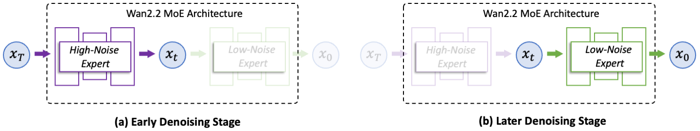

# Wan2.2

<p align="center">
    
<p>

<p align="center">
    💜 <a href="https://wan.video"><b>Wan</b></a> &nbsp&nbsp ｜ &nbsp&nbsp 🖥️ <a href="https://github.com/Wan-Video/Wan2.2">GitHub</a> &nbsp&nbsp  | &nbsp&nbsp🤗 <a href="https://huggingface.co/Wan-AI/">Hugging Face</a>&nbsp&nbsp | &nbsp&nbsp🤖 <a href="https://modelscope.cn/organization/Wan-AI">ModelScope</a>&nbsp&nbsp | &nbsp&nbsp 📑 <a href="https://arxiv.org/abs/2503.20314">Paper</a> &nbsp&nbsp | &nbsp&nbsp 📑 <a href="https://wan.video/welcome?spm=a2ty_o02.30011076.0.0.6c9ee41eCcluqg">Blog</a> &nbsp&nbsp |  &nbsp&nbsp 💬  <a href="https://discord.gg/AKNgpMK4Yj">Discord</a>&nbsp&nbsp
    <br>
    📕 <a href="https://alidocs.dingtalk.com/i/nodes/jb9Y4gmKWrx9eo4dCql9LlbYJGXn6lpz">使用指南(中文)</a>&nbsp&nbsp | &nbsp&nbsp 📘 <a href="https://alidocs.dingtalk.com/i/nodes/EpGBa2Lm8aZxe5myC99MelA2WgN7R35y">User Guide(English)</a>&nbsp&nbsp | &nbsp&nbsp💬 <a href="https://gw.alicdn.com/imgextra/i2/O1CN01tqjWFi1ByuyehkTSB_!!6000000000015-0-tps-611-1279.jpg">WeChat(微信)</a>&nbsp&nbsp
<br>

-----

[**Wan: Open and Advanced Large-Scale Video Generative Models**](https://arxiv.org/abs/2503.20314) <be>


We are excited to introduce **Wan2.2**, a major upgrade to our foundational video models. With **Wan2.2**, we have focused on incorporating the following innovations:

- 👍 **Effective MoE Architecture**: Wan2.2 introduces a Mixture-of-Experts (MoE) architecture into video diffusion models. By separating the denoising process cross timesteps with specialized powerful expert models, this enlarges the overall model capacity while maintaining the same computational cost.

- 👍 **Cinematic-level Aesthetics**: Wan2.2 incorporates meticulously curated aesthetic data, complete with detailed labels for lighting, composition, contrast, color tone, and more. This allows for more precise and controllable cinematic style generation, facilitating the creation of videos with customizable aesthetic preferences.

- 👍 **Complex Motion Generation**: Compared to Wan2.1, Wan2.2 is trained on a significantly larger data, with +65.6% more images and +83.2% more videos. This expansion notably enhances the model's generalization across multiple dimensions such as motions,  semantics, and aesthetics, achieving TOP performance among all open-sourced and closed-sourced models. 

- 👍 **Efficient High-Definition Hybrid TI2V**:  Wan2.2 open-sources a 5B model built with our advanced Wan2.2-VAE that achieves a compression ratio of **16×16×4**. This model supports both text-to-video and image-to-video generation at 720P resolution with 24fps and can also run on consumer-grade graphics cards like 4090. It is one of the fastest **720P@24fps** models currently available, capable of serving both the industrial and academic sectors simultaneously.


## Video Demos

<div align="center">
    <video width="80%" controls>
        <source src="https://cloud.video.taobao.com/vod/4szTT1B0LqXvJzmuEURfGRA-nllnqN_G2AT0ZWkQXoQ.mp4" type="video/mp4">
        Your browser does not support the video tag.
    </video>
</div>

## 🔥 Latest News!!

* Sep 19, 2025: 💃 We introduct **[Wan2.2-Animate-14B](https://humanaigc.github.io/wan-animate)**, an unified model for character animation and replacement with holistic movement and expression replication. We released the [model weights](#model-download) and [inference code](#run-with-wan-animate). And now you can try it on [wan.video](https://wan.video/), [ModelScope Studio](https://www.modelscope.cn/studios/Wan-AI/Wan2.2-Animate) or [HuggingFace Space](https://huggingface.co/spaces/Wan-AI/Wan2.2-Animate)!
* Aug 26, 2025: 🎵 We introduce **[Wan2.2-S2V-14B](https://humanaigc.github.io/wan-s2v-webpage)**, an audio-driven cinematic video generation model, including [inference code](#run-speech-to-video-generation), [model weights](#model-download), and [technical report](https://humanaigc.github.io/wan-s2v-webpage/content/wan-s2v.pdf)! Now you can try it on [wan.video](https://wan.video/),  [ModelScope Gradio](https://www.modelscope.cn/studios/Wan-AI/Wan2.2-S2V) or [HuggingFace Gradio](https://huggingface.co/spaces/Wan-AI/Wan2.2-S2V)!
* Jul 28, 2025: 👋 We have open a [HF space](https://huggingface.co/spaces/Wan-AI/Wan-2.2-5B) using the TI2V-5B model. Enjoy!
* Jul 28, 2025: 👋 Wan2.2 has been integrated into ComfyUI ([CN](https://docs.comfy.org/zh-CN/tutorials/video/wan/wan2_2) | [EN](https://docs.comfy.org/tutorials/video/wan/wan2_2)). Enjoy!
* Jul 28, 2025: 👋 Wan2.2's T2V, I2V and TI2V have been integrated into Diffusers ([T2V-A14B](https://huggingface.co/Wan-AI/Wan2.2-T2V-A14B-Diffusers) | [I2V-A14B](https://huggingface.co/Wan-AI/Wan2.2-I2V-A14B-Diffusers) | [TI2V-5B](https://huggingface.co/Wan-AI/Wan2.2-TI2V-5B-Diffusers)). Feel free to give it a try!
* Jul 28, 2025: 👋 We've released the inference code and model weights of **Wan2.2**.
* Sep 5, 2025: 👋 We add text-to-speech synthesis support with [CosyVoice](https://github.com/FunAudioLLM/CosyVoice) for Speech-to-Video generation task.


## Community Works
If your research or project builds upon [**Wan2.1**](https://github.com/Wan-Video/Wan2.1) or [**Wan2.2**](https://github.com/Wan-Video/Wan2.2), and you would like more people to see it, please inform us.

- [DiffSynth-Studio](https://github.com/modelscope/DiffSynth-Studio) provides comprehensive support for Wan 2.2, including low-GPU-memory layer-by-layer offload, FP8 quantization, sequence parallelism, LoRA training, full training.
- [Kijai's ComfyUI WanVideoWrapper](https://github.com/kijai/ComfyUI-WanVideoWrapper) is an alternative implementation of Wan models for ComfyUI. Thanks to its Wan-only focus, it's on the frontline of getting cutting edge optimizations and hot research features, which are often hard to integrate into ComfyUI quickly due to its more rigid structure.
- [Cache-dit](https://github.com/vipshop/cache-dit) offers Fully Cache Acceleration support for Wan2.2 MoE with DBCache, TaylorSeer and Cache CFG. Visit their [example](https://github.com/vipshop/cache-dit/blob/main/examples/pipeline/run_wan_2.2.py) for more details.
- [FastVideo](https://github.com/hao-ai-lab/FastVideo) includes distilled Wan models with sparse attention that significanly speed up the inference time. 

## 📑 Todo List
- Wan2.2 Text-to-Video
    - [x] Multi-GPU Inference code of the A14B and 14B models
    - [x] Checkpoints of the A14B and 14B models
    - [x] ComfyUI integration
    - [x] Diffusers integration
- Wan2.2 Image-to-Video
    - [x] Multi-GPU Inference code of the A14B model
    - [x] Checkpoints of the A14B model
    - [x] ComfyUI integration
    - [x] Diffusers integration
- Wan2.2 Text-Image-to-Video
    - [x] Multi-GPU Inference code of the 5B model
    - [x] Checkpoints of the 5B model
    - [x] ComfyUI integration
    - [x] Diffusers integration
- Wan2.2-S2V Speech-to-Video
    - [x] Inference code of Wan2.2-S2V
    - [x] Checkpoints of Wan2.2-S2V-14B
    - [x] ComfyUI integration
    - [x] Diffusers integration
- Wan2.2-Animate Character Animation and Replacement
    - [x] Inference code of Wan2.2-Animate
    - [x] Checkpoints of Wan2.2-Animate
    - [x] ComfyUI integration
    - [ ] Diffusers integration    

## Run Wan2.2 Animate

#### Installation
Clone the repo:
```sh
git clone https://github.com/Wan-Video/Wan2.2.git
cd Wan2.2
```

Install dependencies:
```sh
# Ensure torch >= 2.4.0
# If the installation of `flash_attn` fails, try installing the other packages first and install `flash_attn` last
pip install -r requirements.txt
# If you want to use CosyVoice to synthesize speech for Speech-to-Video Generation, please install requirements_s2v.txt additionally
pip install -r requirements_s2v.txt
```


#### Model Download

| Models              | Download Links                                                                                                                              | Description |
|--------------------|---------------------------------------------------------------------------------------------------------------------------------------------|-------------|
| T2V-A14B    | 🤗 [Huggingface](https://huggingface.co/Wan-AI/Wan2.2-T2V-A14B)    🤖 [ModelScope](https://modelscope.cn/models/Wan-AI/Wan2.2-T2V-A14B)    | Text-to-Video MoE model, supports 480P & 720P |
| I2V-A14B    | 🤗 [Huggingface](https://huggingface.co/Wan-AI/Wan2.2-I2V-A14B)    🤖 [ModelScope](https://modelscope.cn/models/Wan-AI/Wan2.2-I2V-A14B)    | Image-to-Video MoE model, supports 480P & 720P |
| TI2V-5B     | 🤗 [Huggingface](https://huggingface.co/Wan-AI/Wan2.2-TI2V-5B)     🤖 [ModelScope](https://modelscope.cn/models/Wan-AI/Wan2.2-TI2V-5B)     | High-compression VAE, T2V+I2V, supports 720P |
| S2V-14B     | 🤗 [Huggingface](https://huggingface.co/Wan-AI/Wan2.2-S2V-14B)     🤖 [ModelScope](https://modelscope.cn/models/Wan-AI/Wan2.2-S2V-14B)     | Speech-to-Video model, supports 480P & 720P |
| Animate-14B | 🤗 [Huggingface](https://huggingface.co/Wan-AI/Wan2.2-Animate-14B) 🤖 [ModelScope](https://www.modelscope.cn/models/Wan-AI/Wan2.2-Animate-14B)  | Character animation and replacement | |


Download models using huggingface-cli:
``` sh
pip install "huggingface_hub[cli]"
huggingface-cli download Wan-AI/Wan2.2-Animate-14B --local-dir ./Wan2.2-Animate-14B
```

Download models using modelscope-cli:
``` sh
pip install modelscope
modelscope download Wan-AI/Wan2.2-Animate-14B --local_dir ./Wan2.2-Animate-14B
```

#### Run Wan-Animate-14B

Wan-Animate takes a video and a character image as input, and generates a video in either "animation" or "replacement" mode. 

1. animation mode： The model generates a video of the character image that mimics the human motion in the input video.
2. replacement mode: The model replaces the character image with the input video.

Please visit our [project page](https://humanaigc.github.io/wan-animate) to see more examples and learn about the scenarios suitable for this model.

##### (1) Preprocessing 
The input video should be preprocessed into several materials before be feed into the inference process.  Please refer to the following processing flow, and more details about preprocessing can be found in [UserGuider](https://github.com/Wan-Video/Wan2.2/blob/main/wan/modules/animate/preprocess/UserGuider.md).

* For animation
```bash
python ./wan/modules/animate/preprocess/preprocess_data.py \
    --ckpt_path ./Wan2.2-Animate-14B/process_checkpoint \
    --video_path ./examples/wan_animate/animate/video.mp4 \
    --refer_path ./examples/wan_animate/animate/image.jpeg \
    --save_path ./examples/wan_animate/animate/process_results \
    --resolution_area 1280 720 \
    --retarget_flag \
    --use_flux
```
* For replacement
```bash
python ./wan/modules/animate/preprocess/preprocess_data.py \
    --ckpt_path ./Wan2.2-Animate-14B/process_checkpoint \
    --video_path ./examples/wan_animate/replace/video.mp4 \
    --refer_path ./examples/wan_animate/replace/image.jpeg \
    --save_path ./examples/wan_animate/replace/process_results \
    --resolution_area 1280 720 \
    --iterations 3 \
    --k 7 \
    --w_len 1 \
    --h_len 1 \
    --replace_flag
```
##### (2) Run in animation mode 

* Single-GPU inference 

```bash
python generate.py --task animate-14B --ckpt_dir ./Wan2.2-Animate-14B/ --src_root_path ./examples/wan_animate/animate/process_results/ --refert_num 1
```

* Multi-GPU inference using FSDP + DeepSpeed Ulysses

```bash
python -m torch.distributed.run --nnodes 1 --nproc_per_node 8 generate.py --task animate-14B --ckpt_dir ./Wan2.2-Animate-14B/ --src_root_path ./examples/wan_animate/animate/process_results/ --refert_num 1 --dit_fsdp --t5_fsdp --ulysses_size 8
```

##### (3) Run in replacement mode 

* Single-GPU inference 

```bash
python generate.py --task animate-14B --ckpt_dir ./Wan2.2-Animate-14B/ --src_root_path ./examples/wan_animate/replace/process_results/ --refert_num 1 --replace_flag --use_relighting_lora 
```

* Multi-GPU inference using FSDP + DeepSpeed Ulysses

```bash
python -m torch.distributed.run --nnodes 1 --nproc_per_node 8 generate.py --task animate-14B --ckpt_dir ./Wan2.2-Animate-14B/ --src_root_path ./examples/wan_animate/replace/process_results/src_pose.mp4  --refert_num 1 --replace_flag --use_relighting_lora --dit_fsdp --t5_fsdp --ulysses_size 8
```

> 💡 If you're using **Wan-Animate**, we do not recommend using LoRA models trained on `Wan2.2`, since weight changes during training may lead to unexpected behavior.

## Computational Efficiency on Different GPUs

We test the computational efficiency of different **Wan2.2** models on different GPUs in the following table. The results are presented in the format: **Total time (s) / peak GPU memory (GB)**.


<div align="center">
    
</div>

> The parameter settings for the tests presented in this table are as follows:
> (1) Multi-GPU: 14B: `--ulysses_size 4/8 --dit_fsdp --t5_fsdp`, 5B: `--ulysses_size 4/8 --offload_model True --convert_model_dtype --t5_cpu`; Single-GPU: 14B: `--offload_model True --convert_model_dtype`, 5B: `--offload_model True --convert_model_dtype --t5_cpu`
(--convert_model_dtype converts model parameter types to config.param_dtype);
> (2) The distributed testing utilizes the built-in FSDP and Ulysses implementations, with FlashAttention3 deployed on Hopper architecture GPUs;
> (3) Tests were run without the `--use_prompt_extend` flag;
> (4) Reported results are the average of multiple samples taken after the warm-up phase.


-------

## Introduction of Wan2.2

**Wan2.2** builds on the foundation of Wan2.1 with notable improvements in generation quality and model capability. This upgrade is driven by a series of key technical innovations, mainly including the Mixture-of-Experts (MoE) architecture, upgraded training data, and high-compression video generation.

##### (1) Mixture-of-Experts (MoE) Architecture

Wan2.2 introduces Mixture-of-Experts (MoE) architecture into the video generation diffusion model. MoE has been widely validated in large language models as an efficient approach to increase total model parameters while keeping inference cost nearly unchanged. In Wan2.2, the A14B model series adopts a two-expert design tailored to the denoising process of diffusion models: a high-noise expert for the early stages, focusing on overall layout; and a low-noise expert for the later stages, refining video details. Each expert model has about 14B parameters, resulting in a total of 27B parameters but only 14B active parameters per step, keeping inference computation and GPU memory nearly unchanged.

<div align="center">
    
</div>

The transition point between the two experts is determined by the signal-to-noise ratio (SNR), a metric that decreases monotonically as the denoising step $t$ increases. At the beginning of the denoising process, $t$ is large and the noise level is high, so the SNR is at its minimum, denoted as ${SNR}_{min}$. In this stage, the high-noise expert is activated. We define a threshold step ${t}_{moe}$ corresponding to half of the ${SNR}_{min}$, and switch to the low-noise expert when $t<{t}_{moe}$.

<div align="center">
    
</div>

To validate the effectiveness of the MoE architecture, four settings are compared based on their validation loss curves. The baseline **Wan2.1** model does not employ the MoE architecture. Among the MoE-based variants, the **Wan2.1 & High-Noise Expert** reuses the Wan2.1 model as the low-noise expert while uses the  Wan2.2's high-noise expert, while the **Wan2.1 & Low-Noise Expert** uses Wan2.1 as the high-noise expert and employ the Wan2.2's low-noise expert. The **Wan2.2 (MoE)** (our final version) achieves the lowest validation loss, indicating that its generated video distribution is closest to ground-truth and exhibits superior convergence.


##### (2) Efficient High-Definition Hybrid TI2V
To enable more efficient deployment, Wan2.2 also explores a high-compression design. In addition to the 27B MoE models, a 5B dense model, i.e., TI2V-5B, is released. It is supported by a high-compression Wan2.2-VAE, which achieves a $T\times H\times W$ compression ratio of $4\times16\times16$, increasing the overall compression rate to 64 while maintaining high-quality video reconstruction. With an additional patchification layer, the total compression ratio of TI2V-5B reaches $4\times32\times32$. Without specific optimization, TI2V-5B can generate a 5-second 720P video in under 9 minutes on a single consumer-grade GPU, ranking among the fastest 720P@24fps video generation models. This model also natively supports both text-to-video and image-to-video tasks within a single unified framework, covering both academic research and practical applications.


<div align="center">
    
</div>


##### Comparisons to SOTAs
We compared Wan2.2 with leading closed-source commercial models on our new Wan-Bench 2.0, evaluating performance across multiple crucial dimensions. The results demonstrate that Wan2.2 achieves superior performance compared to these leading models.


<div align="center">
    
</div>

## Citation
If you find our work helpful, please cite us.

```
@article{wan2025,
      title={Wan: Open and Advanced Large-Scale Video Generative Models}, 
      author={Team Wan and Ang Wang and Baole Ai and Bin Wen and Chaojie Mao and Chen-Wei Xie and Di Chen and Feiwu Yu and Haiming Zhao and Jianxiao Yang and Jianyuan Zeng and Jiayu Wang and Jingfeng Zhang and Jingren Zhou and Jinkai Wang and Jixuan Chen and Kai Zhu and Kang Zhao and Keyu Yan and Lianghua Huang and Mengyang Feng and Ningyi Zhang and Pandeng Li and Pingyu Wu and Ruihang Chu and Ruili Feng and Shiwei Zhang and Siyang Sun and Tao Fang and Tianxing Wang and Tianyi Gui and Tingyu Weng and Tong Shen and Wei Lin and Wei Wang and Wei Wang and Wenmeng Zhou and Wente Wang and Wenting Shen and Wenyuan Yu and Xianzhong Shi and Xiaoming Huang and Xin Xu and Yan Kou and Yangyu Lv and Yifei Li and Yijing Liu and Yiming Wang and Yingya Zhang and Yitong Huang and Yong Li and You Wu and Yu Liu and Yulin Pan and Yun Zheng and Yuntao Hong and Yupeng Shi and Yutong Feng and Zeyinzi Jiang and Zhen Han and Zhi-Fan Wu and Ziyu Liu},
      journal = {arXiv preprint arXiv:2503.20314},
      year={2025}
}
```

## License Agreement
The models in this repository are licensed under the Apache 2.0 License. We claim no rights over the your generated contents, granting you the freedom to use them while ensuring that your usage complies with the provisions of this license. You are fully accountable for your use of the models, which must not involve sharing any content that violates applicable laws, causes harm to individuals or groups, disseminates personal information intended for harm, spreads misinformation, or targets vulnerable populations. For a complete list of restrictions and details regarding your rights, please refer to the full text of the [license](LICENSE.txt).


## Acknowledgements

We would like to thank the contributors to the [SD3](https://huggingface.co/stabilityai/stable-diffusion-3-medium), [Qwen](https://huggingface.co/Qwen), [umt5-xxl](https://huggingface.co/google/umt5-xxl), [diffusers](https://github.com/huggingface/diffusers) and [HuggingFace](https://huggingface.co) repositories, for their open research.


## Contact Us
If you would like to leave a message to our research or product teams, feel free to join our [Discord](https://discord.gg/AKNgpMK4Yj) or [WeChat groups](https://gw.alicdn.com/imgextra/i2/O1CN01tqjWFi1ByuyehkTSB_!!6000000000015-0-tps-611-1279.jpg)!

